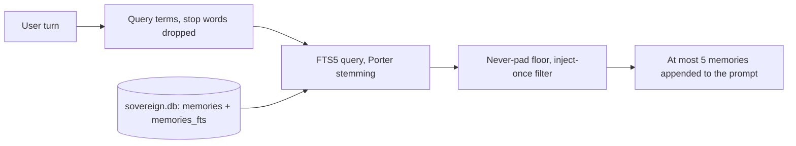

# Memory architecture

Updated: 2026-09-29

Memory is Rust, local, and costs no model call. Design history and measurements: `MEMORY_DESIGN.md`.

## Recall: an indexed full-text query

- Storage: the engine's `sovereign.db` (jcode home, WAL). A lean `memories` table (searchable text, tags,
  scope, active flag) has an FTS5 index kept in sync by triggers. The full entry JSON and the embedding
  (little-endian f32 bytes) live in `memory_entries` and are read only for the final results. Graph
  shape (tags, clusters, edges) is one row per scope in `memory_graphs`. Scopes: `global` and
  `project:<hash of the project dir>`. Code: `crates/jcode-base/src/memory_store.rs`.
- Recall runs inline for the user turn being answered (`memory_agent::recall_local_now`,
  `MemoryManager::recall_local`, terms and floor in `memory_recall.rs`). A memory is injected at most once
  per session, and nothing is injected when nothing matches (the never-pad floor). Measured at 10k
  memories: 6.2 ms per recall, 6.3 ms to save one memory.
- No embedding model, no reranker, no remote relevance service (Jev), no background sidecar. Nothing about
  recall leaves the machine. Legacy embedding fields are kept on disk and ignored.
- Writes: the `memory` tool and the Prime learning loop (`sovereign-gateway/src/learn.rs`, gated by the
  turn and cooldown limits in `REQUIREMENTS.md`). A learned memory's text is stored once, here; its
  learning entry keeps a label and the memory id.
- The desktop memory screen lists, edits, forgets and resets memories in every scope
  (`memory_rest.rs`); deletions are audited in `memory_deletions`.

## Schema versioning

There is one `PRAGMA user_version` for the whole file, owned by `crates/sovereign-prime/src/migrate.rs`.
The memory store calls it when it opens the file, so memory gets the same rules as every other table: a
backup `sovereign.db.pre-v<N>.bak` before migrating a file with data, and refusal of a file from a newer
engine. The legacy inline-entry to `memory_entries` layout change is migration 4. After migrating, the
store re-applies its own `CREATE ... IF NOT EXISTS` schema. Update rollback: `docs/RELEASING.md`.

## Legacy import

JSON graphs from older installs (`~/.jcode/memory/global.json`, `projects/<hash>.json`) are imported once
and renamed `*.imported`.

## Privacy

Memories never leave the machine through recall. Do not store secrets in memory; the model can read every
injected memory and the learning loop can write new ones.
